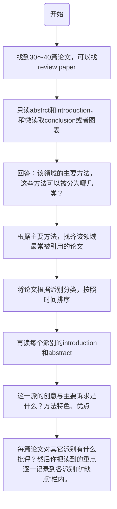

# How to read a paper?
## 为什么读论文很难？
期刊论文和大学的课本截然不同。大学的课本是循次渐进地从最基本的知识背景逐步交代出整套系统知识，只要你逐页读下去，就可以整本都读懂。但是期刊论文是没头没尾的十几页文献，只交代最核心的创意，并援引许多其它论文的研究成果（但只注明文献出处，而完全没有交代其内容）。

因此，要读懂一篇论文，一定要同时读懂数篇或十数篇被援引的其它论文。偏偏，这十几篇被援引的论文又各自援引十数篇其它论文。因此，相对于大学部的教科书而言，期刊论文是一个极端没有系统的知识，必须要靠读者自己从几十篇论文中撷取出相关的片段，自己组织成一个有系统的知识，然后才有办法开始阅读与吸收。要培养出这种自己组织知识的能力，需要在学校靠着大量而持续的时间去摸索、体会，而不可能只利用业余的零星时间去培养。

## 一篇论文的结构
### abstract
说明这篇论文的主要贡献、方法特色与主要内容。必须要学会只看 Abstract 和Introduction便可以判断出这篇论文的重点和你的研究有没有直接关联，从而决定要不要把它给读完。假如你有能力每三十篇论文只根据摘要和简介便能筛选出其中最密切相关的五篇论文，你就比别人的效率高五倍以上。以后不管是做事或做学术研究，都比别人有能力从更广泛的文献中挑出最值得参考的资料。

### introduction
introduction的功能是介绍问题的背景和起源，交代前人在这个题目上已经有过的主要贡献，说清楚前人留下来的问题，以及在这个背景下这篇论文想解决的问题和它的意义。对初学的学生而言，从这里可以了解以前研究的概况。

通常我会建议初学的学生，对你的题目不熟时，先把跟你题目可能相关的论文收集个 30～40篇，每篇都只读Abstract 和 Introduction，而不要读 Main Body（本文），只在必要时稍微参考一下后面的 Illustrative examples和 Conclusions，直到你能回答下面这四个问题：
 - 在这领域内最常被引述的方法有哪些？
 - 这些方法可以分成哪些主要派别？
 - 每个派别的主要特色（含优点和缺点）是什么？
 - 这个领域内大家认为重要的关键问题有哪些？有哪些特性是大家重视的优点？有哪些特性是大家在意的缺点？这些优点与缺点通常在哪些应用场合时会比较被重视？在哪些应用场合时比较不会被重视？

### Main Body
（3A）这篇论文的主要假设是什么（在什么条件下它是有效的），并且评估一下这些假设在现实条件下有多容易（或多难）成立。愈难成立的假设，愈不好用，参考价值也愈低。

（3B）在这些假设下，这篇论文主要有什么好处。

（3C）这些好处主要表现在哪些公式的哪些项目的简化上。至于整篇论文详细的推导过程，你不需要懂。除了三、五个关键的公式（最后在应用上要使用的公式，你可以从这里评估出这个方法使用上的方便程度或计算效率，以及在非理想情境下这些公式使用起来的可靠度或稳定性）之外，其它公式都不懂也没关系，公式之间的恒等式推导过程可以完全略过去。假如你要看公式，重点是看公式推导过程中引入的假设条件，而不是恒等式的转换。

（3D）这一派主要的缺点有哪些。
# 参考文献

https://www.jiqizhixin.com/articles/2019-02-22-5
